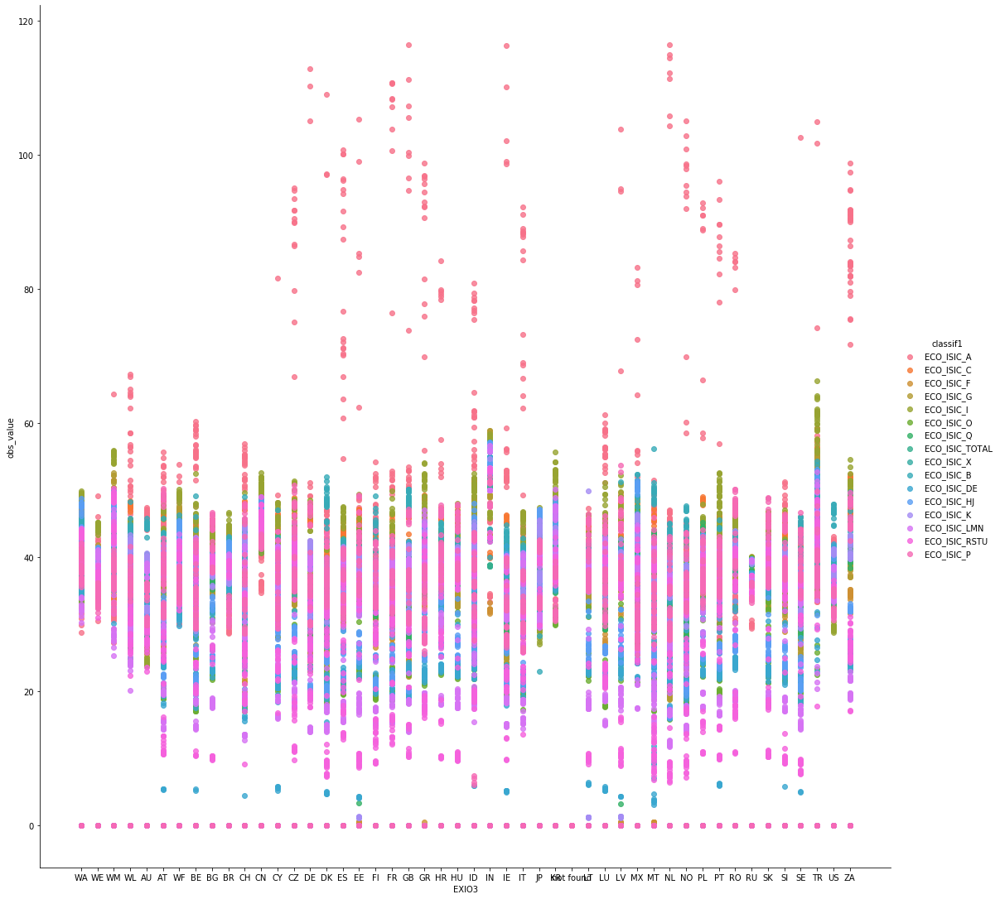
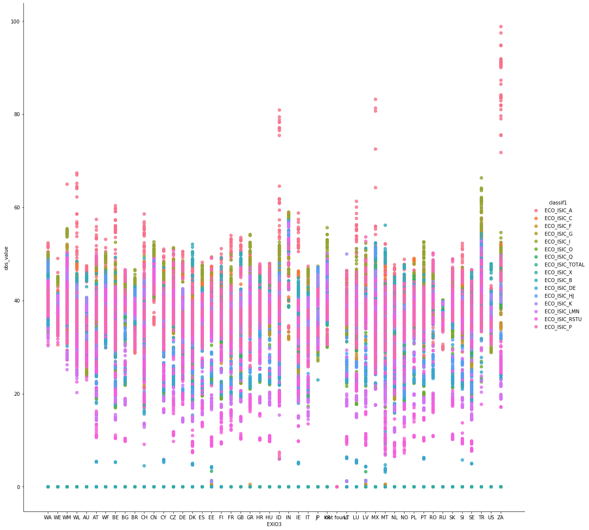

# labor_extension
The accuracy of social satellite data is crucial in assessing the social and economic impacts of geographic locations and stakeholder categories along the life cycle of products. Our primary source of information was the [International Labour Organization (ILO)](https://www.ilo.org/), a United Nations agency that developed the [ILO Modelled Estimates (ILOEST)](https://ilostat.ilo.org/methods/concepts-and-definitions/ilo-modelled-estimates/). This model provides accurate employment data at a country and sector level and ensures the reliability and robustness of our findings. 

# Sources
* Employment by sex and economic activity -- ILO modelled estimates, Nov. 2024 - Annual : [Here](https://rshiny.ilo.org/dataexplorer22/?lang=en&segment=indicator&id=EMP_2EMP_SEX_ECO_NB_A)
* Mean weekly hours actually worked per employed person by sex and ecoomic activity - Annual : [Here](https://rshiny.ilo.org/dataexplorer22/?lang=en&segment=indicator&id=HOW_TEMP_SEX_ECO_NB_A)
* Average number of usual weekly hours of work in main job, by sex, age, professional status, full-time/part-time and economic activity (1998-2008, NACE Rev. 1.1) : [Here](https://ec.europa.eu/eurostat/databrowser/view/lfsa_ewhuna/default/table?lang=en)
# Overview
We used the same definition than ILOEST for employed persons: all persons of working age who, during a specified brief period, were in the following categories: Paid employment (whether at work or with a job but not at work), or self-employment (whether at work or with an enterprise but not at work). For the missing data, ILOEST includes nationally reported observations and imputed data for countries with missing data. The imputations are not based on proxies but on a series of econometric models developed by ILO (ILO, 2023). In summary, the construction of the ILOEST database employs a dual-method approach to achieve global consistency and reliability. Nearly half of its dataset is curated from authoritative figures like national labour force surveys and government statistics, which are renowned for their cross-national comparability. To complete the database, an estimation procedure is performed directly by ILO via ILOEST. This involves logistic transformations to normalize labour force participation rates, interpolation techniques to fill data gaps, remedies for non-response biases, and the utilization of weighted least squares models for definitive country-level estimates. 
It is important to note that the ILOEST database, while comprehensive, covers only 186 countries or regions, despite the inclusion of estimated data. In contrast, the United Nations' "Standard Country or Area Codes for Statistical Use1", which serves as the primary classification system for UN publications and databases, identifies 249 unique ISO-alpha3 coded areas. Given the ILO's affiliation with the UN and its use of the M49 standard, adopting this framework helps mitigate risks of double-counting or omissions. Consequently, data for the 63 areas or countries not currently included in the ILOEST database have been supplemented by aggregating information from the [CIA World Factbook](https://www.cia.gov/the-world-factbook/) (Central Intelligence Agency, 2021), additional ILO datasets, and [Eurostat](https://github.com/EXIOBASE/labor_extension/blob/main/aux/countries_en.csv) data. 

# Preparing and completing ILOEST data
The overarching aim of this computational process is to enhance the specificity and longitudinal scope of workforce data, with particular emphasis on economic activity, gender distinctions, and the 1995-2022 timeframe to facilitate updates to Multi-Region Input-Output (MRIO) models.The replicable steps include:
1. Data Frame Initialization: A data frame is constructed incorporating extant data from the ILOEST database.
2. ISO-EXIOBASE Conversion: Country codes, in ISO-alpha3 format, are mapped to their EXIOBASE classifications, expedited by the ["coco converter"](https://github.com/IndEcol/country_converter) module.
3. CIA World Factbook Integration: Workforce data for 259 countries or areas are drawn from the CIA World Factbook. A [json file](https://raw.githubusercontent.com/EXIOBASE/labor_extension/refs/heads/main/aux/CIA.json) is available in the **aux** folder. Cross-validation against the ILOEST database and the M49 standard yields 43 previously unaccounted-for entities.
4. Entity Tagging: These 43 entities are then categorized for a given year based on their ILO region, subregion, and World Bank income group. This can be done with this [file](https://github.com/EXIOBASE/labor_extension/blob/main/aux/countries_en.csv), also available in the **aux** directory :
   
| ISO3 Code |   Country   |        ILO Region       |         ILO Subregion - Broad         | ILO Subregion - Detailed | World Bank Income Group | Is ILO member? | Included in ILO estimates? |
|:---------:|:-----------:|:-----------------------:|:-------------------------------------:|:------------------------:|:-----------------------:|:--------------:|:--------------------------:|
| AFG       | Afghanistan | Asia and the Pacific    | Southern Asia                         | Southern Asia            | Low income              | Yes            | Yes                        |
| ALB       | Albania     | Europe and Central Asia | Northern, Southern and Western Europe | Southern Europe          | Upper-middle income     | Yes            | Yes                        |
| DZA       | Algeria     | Africa                  | Northern Africa                       | Northern Africa          | Lower-middle income     | Yes            | Yes                        |

6. Workforce Segmentation: Workforce data for the aforementioned 43 entities are further disaggregated by economic activity and gender, employing ILOEST-derived average ratios.
To illustrate, consider Aruba (ISO-alpha3 code: ABW), one of the 43 identified entities. It had a total workforce of 51,610 in 2007. Its classifications were as follows: ILO Region: Americas, ILO Subregion: Latin America and the Caribbean, World Bank Income Group: High Income. Based on these parameters, we extracted corresponding workforce distribution ratios for gender and economic activity sectors from ILOEST and applied them to Aruba's 2007 workforce data.
7. Addressing Temporal Gaps: In cases where annual data were missing from the CIA World Factbook, the corresponding ILO subregion and World Bank income group trends were employed to fill the gaps.

As an example, if Aruba's 2008 data was missing but a 2% increase in men working in a specific sector was observed between 2007 and 2008 in the ILOEST database, this rate was applied to Aruba's 2007 data.
Note: For the remaining 20 countries or areas absent from both the ILOEST database and the CIA World Factbook, we compiled workforce data from diverse sources and employed the same segmentation methodology delineated above. The detailed results classified by ISO alpha-3 code, EXIOBASE geographical code, gender, economic sector (as per ISIC Rev.4), and year.

# Splitting the workforce into the different EXIOBASE economic sectors
Following the comprehensive workforce table obtained in the preceding steps -classified by ISO alpha-3 code, EXIOBASE geographical code, gender, economic sector (as per ISIC Rev.4), and year- the subsequent imperative is to realign these data according to EXIOBASE's distinct economic sector classifications.
Operating under the assumption that wages within a given economic sector and qualification level exhibit marginal variation, we utilized EXIOBASE's economic wage data as a scaling factor for translating ISIC Rev.4 classifications to their EXIOBASE counterparts. This approach is particularly viable given that EXIOBASE wage data are derived directly from international monetary flows and offer yearly granularity, further differentiated by gender and three levels of qualifications, namely:
* Low-skilled Qualification
* Middle-skilled Qualification
* High-skilled Qualification
  
By leveraging these EXIOBASE wage metrics as a conversion mechanism, we successfully transpose our dataset from ISIC Rev.4 classifications into the EXIOBASE framework.
The conversion from ISIC sector to EXIOBASE subsector is done accordingly to this [table](https://github.com/EXIOBASE/labor_extension/blob/main/aux/Exiobase_ISIC_Rev-4.xlsx).

Then for each EXIOBASE subsector j of its ISIC sector i, country k, gender g and year h we calculated the EXIOBASE subsector employment by: 

Where:

* 
   : the previously calculated ISIC workforce for sector i, country k, gender g and year h

* 
   : The EXIOBASE salary vector of the sub-sector j, country k, gender g and year h
 
Then the workforce results are available for each EXIOBASE area/region, gender, year, level of qualification and EXIOBASE sector. 

# Converting number of employees into number of working hours
In the final step, it is crucial to shift from looking at the number of employees to the total hours worked. This adjustment is important for a better understanding of the social risks that workers may face. If two countries have the same production levels, social risks, and number of workers we might think the risk of social issues would be the same in both countries. However, if workers in the first country are twice as productive, they would spend half as much time at work compared to the second country. This means they would have a lower chance of facing social issues, simply because they are exposed to the risk for less time. 
To perform this conversion from the workforce to the number of working hours, we used some external data: Eurostat data, which indicates the average working hour per gender, age, economic activity (NACE classification) and year for European countries and ILO data, which lists the mean weekly hours worked per employed person, detailed per gender and economic activity. For ILO, the dataset was maintained in its entirety except for null values, which were excluded to ensure data quality. By their nature, the Eurostat data was subject to a more targeted selection process:
* Age and Gender: Data was filtered to include only individuals aged 15 to 64, with a gender breakdown into male (M) and female (F).
* Level of Aggregation: Aggregated values were eliminated in favor of individual country-level data.
* Time Commitment: Both full-time and part-time employment statuses were retained.
* Employment Status: The dataset was limited to those who are employed and self-employed.
* Economic Activity: Data was refined to encompass only NACE activities A and B (i.e., Agriculture and Forestry, sectors where the ISIC classification matches with the NACE classification). 
* Time Span: The temporal range was set to include years from 1992 through 2008.
This meticulous data curation enables a more accurate and nuanced evaluation of workforce-related social risks, particularly by focusing on variables that significantly contribute to the risk exposure time.

As we can see (Figure above), some data was missing. To estimate the missing data, we proceed to an interpolation followed by an extrapolation. Linear interpolation has been done when one year is missing data for two years with known values. For the extrapolation, different situations have been considered:
• If only one value is available, this value is kept for all years (the productivity is not changing dramatically from one year to another, and it would induce more uncertainty to try to extrapolate this number),  
• If there are two known values, we calculate the average and allocate this value to the years where the value is unknown.
• If there are three or more known values, we look at the number of consecutive values. To get the unknown value before the first known value, we average the known values and allocate the result to the unknown value. We then carry on with the same method by averaging over the same number of known values.

As a last point, it's crucial to address the transition in the International Standard Industrial Classification of All Economic Activities (ISIC) that took place between 2008 and 2009, shifting from ISIC Revision 3 to Revision 4. To maintain data continuity spanning from 1995 to 2020, we translated the ISIC rev.3 values into their ISIC rev.4 equivalents for the period of 1995-2008 using this [table](https://github.com/EXIOBASE/labor_extension/blob/main/aux/correspondance_ISIC3_ISIC4.xls):
| ISIC 3 sector                                                                                          | Part of the ISIC 3 sector split into ISIC 4 | ISIC 4 sector receiving the part of the  ISIC 3 calculated |
|--------------------------------------------------------------------------------------------------------|---------------------------------------------|------------------------------------------------------------|
|  A. Agriculture, hunting and forestry                                                                  | 1.000                                       |  A. Agriculture; forestry and fishing                      |
|  B. Fishing                                                                                            | 1.000                                       |  A. Agriculture; forestry and fishing                      |
|  C. Mining and quarrying                                                                               | 1.000                                       |  B. Mining and quarrying                                   |
|  D. Manufacturing                                                                                      | 1.000                                       |  C. Manufacturing                                          |
|  F. Construction                                                                                       | 0.050                                       |  C. Manufacturing                                          |
|  G. Wholesale and retail trade; repair of motor vehicles, motorcycles and personal and household goods | 0.018                                       |  C. Manufacturing                                          |
|  I. Transport, storage and communications                                                              | 0.029                                       |  C. Manufacturing                                          |
|  K. Real estate, renting and business activities                                                       | 0.014                                       |  C. Manufacturing                                          |

This translation introduced a degree of data scatter, most notably within the ISIC rev.3 Sector A, which encompasses Agriculture, Forestry, and Fishing activities (corresponding to NACE sectors A and B), with the effect particularly pronounced in European data. 

To mitigate this data scatter, we opted to replace ISIC rev.3 Sector A values from 1995-2008 with the corresponding NACE sector A data derived from Eurostat, as depicted in the next Figure. This refinement allows for a more coherent longitudinal analysis of economic sectors, particularly in evaluating social risks associated with these sectors. 

ISIC values                |  Values with Eurostat
:-------------------------:|:-------------------------:
   |  

Finally, the average working hour per EXIOBASE region, economic activity, gender, and year is calculated using the abovementioned ratios. The calculation is detailed at the ISO alpha-3 country level. Then for the EXIOBASE area aggregating several countries, the average working hour for one EXIOBASE region is an average of the different countries of this area weighted by the workforce of this EXIOBASE area.
This above methode gives us the average working hours per week. 
In order to get the annual average working hours, we use 

