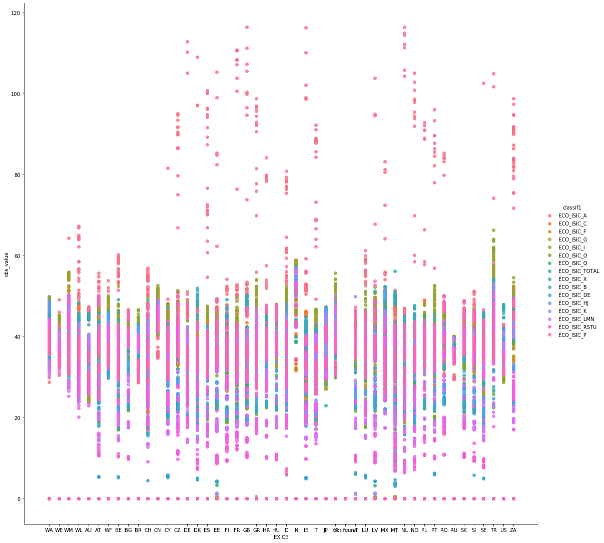
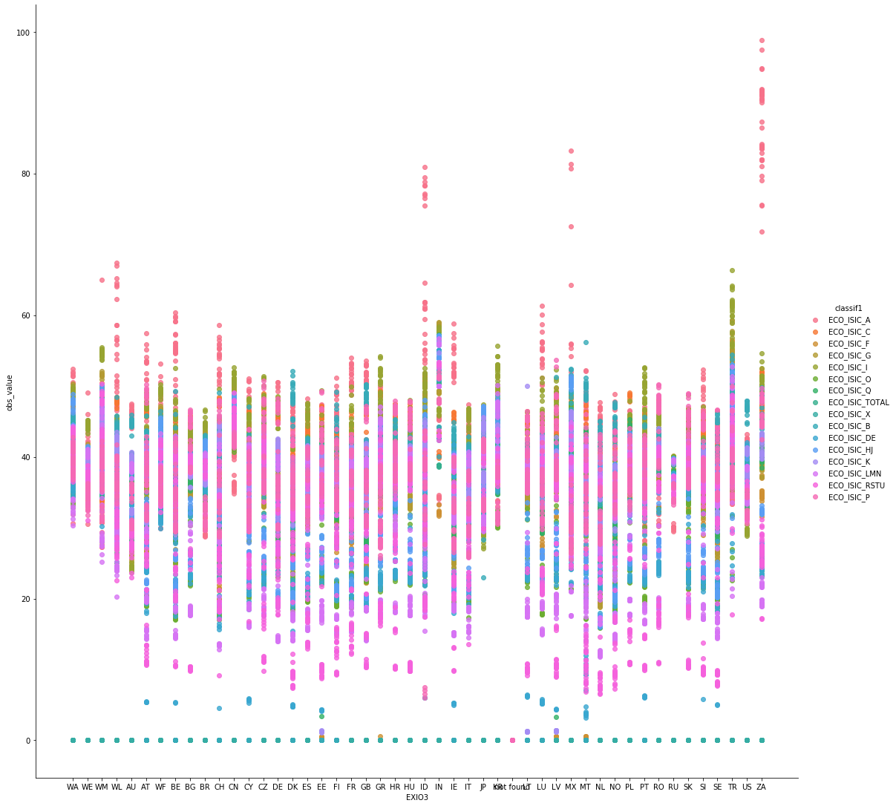

# labor.py

labor is a Python library for calculating the workforce and the average working hour par ISO3 country / year / sex and ISIC 4 categories.

## Description

labor.py is composed of 3 main modules : download, workforce and average_working_hour.


``` python
from download import download_data
from workforce import workforce_calculation
from average_working_hours import working_hour
```


The data are downloaded from the [International labor organization](https://www.ilo.org/global/lang--en/index.htm), [Eurostat](https://ec.europa.eu/eurostat) and from [the CIA World Factbook](https://www.cia.gov/the-world-factbook/).


### 1. download

The download.py module download data from url and store in download folder. Then the data are Unzip and store in the data folder.

``` python
storage_root = Path(".").absolute()
download_path = storage_root / "download"
data_path = storage_root / "data"
```


```python
download_data(src_url,src_csv,src_url2,src_csv2,src_url3,src_csv3)
```

### 2. workforce

```python
workforce = workforce_calculation(data_path,src_csv,src_csv2)
```

For the workforce calculation, we import 3 modules :
```python
from ref_label import add_ref_label
from from_cia_to_ilo import cia_to_ilo
from salary_split import salary_split_year
```

From ILO, we get, for each country (ref_area), sex, year (time) and economic activity (classif1) the employment(obs_value) :

| ref_area | indicator           | source  | sex   | classif1            | time | obs_value |
|----------|---------------------|---------|-------|---------------------|------|-----------|
| AFG      | EMP_2EMP_SEX_ECO_NB | XA:2198 | SEX_T | ECO_DETAILS_TOTAL   | 1991 | 2923.281  |
| AFG      | EMP_2EMP_SEX_ECO_NB | XA:2198 | SEX_T | ECO_DETAILS_A       | 1991 | 1854.403  |
| AFG      | EMP_2EMP_SEX_ECO_NB | XA:2198 | SEX_T | ECO_DETAILS_B       | 1991 | 5.82      |
| AFG      | EMP_2EMP_SEX_ECO_NB | XA:2198 | SEX_T | ECO_DETAILS_C       | 1991 | 150.362   |
| AFG      | EMP_2EMP_SEX_ECO_NB | XA:2198 | SEX_T | ECO_DETAILS_DE      | 1991 | 3.317     |
| AFG      | EMP_2EMP_SEX_ECO_NB | XA:2198 | SEX_T | ECO_DETAILS_F       | 1991 | 203.942   |
| AFG      | EMP_2EMP_SEX_ECO_NB | XA:2198 | SEX_T | ECO_DETAILS_G       | 1991 | 198.676   |
| AFG      | EMP_2EMP_SEX_ECO_NB | XA:2198 | SEX_T | ECO_DETAILS_HJ      | 1991 | 100.881   |
| AFG      | EMP_2EMP_SEX_ECO_NB | XA:2198 | SEX_T | ECO_DETAILS_I       | 1991 | 6.051     |
| AFG      | EMP_2EMP_SEX_ECO_NB | XA:2198 | SEX_T | ECO_DETAILS_K       | 1991 | 1.572     |
| AFG      | EMP_2EMP_SEX_ECO_NB | XA:2198 | SEX_T | ECO_DETAILS_LMN     | 1991 | 8.442     |
| AFG      | EMP_2EMP_SEX_ECO_NB | XA:2198 | SEX_T | ECO_DETAILS_O       | 1991 | 145.662   |
| AFG      | EMP_2EMP_SEX_ECO_NB | XA:2198 | SEX_T | ECO_DETAILS_P       | 1991 | 14.215    |
| AFG      | EMP_2EMP_SEX_ECO_NB | XA:2198 | SEX_T | ECO_DETAILS_Q       | 1991 | 203.657   |
| AFG      | EMP_2EMP_SEX_ECO_NB | XA:2198 | SEX_T | ECO_DETAILS_RSTU    | 1991 | 26.282    |

ILO data comprise all persons of working age who, during a specified brief period, were in the following categories: 
1.  paid employment (whether at work or with a job but not at work); 
2.  self-employment (whether at work or with an enterprise but not at work). 

ILO Data are disaggregated by economic activity, which refers to the main activity of the establishment in which a person worked during the reference period. 
The series is part of the [ILO modelled](https://www.ilo.org/ilostat-files/Documents/TEM.pdf). As such, missing data have been estimated and harmonized directly from the ILO model to account for differences in national data and scope of coverage, collection and tabulation methodologies as well as for other country-specific factors (for detailed information about ILO projections see: [ILO modelled estimates and projections](https://ilostat.ilo.org/resources/concepts-and-definitions/ilo-modelled-estimates/).

However, despite the estimated missing data, ILO data do not contain information for all the different Exiobase countries listed in [Exiobase](https://www.exiobase.eu/). 
Part of the missing information can be calcullated by combining data from the CIA World Factbook (these data are available in the **aux** folder : CIA.json) and ILO data. 

```python
with open("aux/CIA.json", "r") as read_file:
    data_cia = json.load(read_file)
```

For each missing country available in the World Fact Book but not in the ILO data, two different pieces of information are necessary:

1. The corresponding ILO region or ILO subregion to the missing country belongs;
2. The corresponding World Bank income level to the missing country belongs. 

These information are found in a dataframe called **correspondance**, which we import from a csv file found in the **aux** folder.
```python 
    filename = Path('aux/countries_en.csv')
    correspondance_ilo = pd.read_csv(filename)
```
| ISO3 Code | Country             | ILO Region              | ILO Subregion - Broad                 | ILO Subregion - Detailed | World Bank Income Group |
|-----------|---------------------|-------------------------|---------------------------------------|--------------------------|-------------------------|
| AFG       | Afghanistan         | Asia and the Pacific    | Southern Asia                         | Southern Asia            | Low income              |
| ALB       | Albania             | Europe and Central Asia | Northern, Southern and Western Europe | Southern Europe          | Upper-middle income     |
| DZA       | Algeria             | Africa                  | Northern Africa                       | Northern Africa          | Lower-middle income     |
| ASM       | American Samoa      | Asia and the Pacific    | South-Eastern Asia and the Pacific    | Pacific Islands          | Upper-middle income     |
| AND       | Andorra             | Europe and Central Asia | Northern, Southern and Western Europe | Southern Europe          | High income             |
| AGO       | Angola              | Africa                  | Sub-Saharan Africa                    | Central Africa           | Lower-middle income     |
| AIA       | Anguilla            | Americas                | Latin America and the Caribbean       | Caribbean                | Upper-middle income     |
| ATG       | Antigua and Barbuda | Americas                | Latin America and the Caribbean       | Caribbean                | High income             |
| ARG       | Argentina           | Americas                | Latin America and the Caribbean       | South America            | Upper-middle income     |


As such, for each missing country available in the World Fact Book but not in the ILO data we get: 
1. From the **correspondance table**, the corresponding  **ILO region** and  **world bank income group**.
2. From **CIA**, for certain years, the total workforce.

Then, from ILO data, we calcualte for every pair: ILO region / World bank level of income the average workforce detailed by sex, year and economic activity.

For exemple ASM (American Samoa) is missing from ILO data.
We look into the correspondance table and find out the ILO Region, ILO Subregion and the World Bank Income Group:

| ISO3 Code | Country        | ILO Region           | ILO Subregion - Broad              | ILO Subregion - Detailed | World Bank Income Group |
|-----------|----------------|----------------------|------------------------------------|--------------------------|-------------------------|
| ASM       | American Samoa | Asia and the Pacific | South-Eastern Asia and the Pacific | Pacific Islands          | Upper-middle income     |

Therefore, American Samoa is part of the ILO subregion: South-Eastern Asia and the Pacific. 
Furthermore, American Samoa is also part of the world bank income group: upper-middle-income.

From CIA, we get the total workforce (for both gender) for a certain year :

|           "labor_force": {           |   |   |
|--------------------------------------|---|---|
|             "total_size": {          |   |   |
|               "total_people": 17850, |   |   |
|               "global_rank": 213,    |   |   |
|               "date": "2015"         |   |   |

From CIA, we know that the total American Samoa workforce in **2015** was **17850**.

From ILO, we know how the total workforce of a ILO region (for a certain world bank income group) for a certain year is distributed over the different category. Lets see how the population in 2015 for the Pacific Islands region, Upper-middle income, was distributed over the classifications:

| ref_area | ref_area.label                                          | EXIO3     | indicator           | source  | sex   | classif1          | time | obs_value  |
|----------|---------------------------------------------------------|-----------|---------------------|---------|-------|-------------------|------|------------|
| X52      | South-Eastern Asia and the Pacific: Upper-middle income | not found | EMP_2EMP_SEX_ECO_NB | XA:8435 | SEX_T | ECO_DETAILS_TOTAL | 2015 | 172292.597 |
| X52      | South-Eastern Asia and the Pacific: Upper-middle income | not found | EMP_2EMP_SEX_ECO_NB | XA:8435 | SEX_T | ECO_DETAILS_A     | 2015 | 53674.541  |
| X52      | South-Eastern Asia and the Pacific: Upper-middle income | not found | EMP_2EMP_SEX_ECO_NB | XA:8435 | SEX_T | ECO_DETAILS_B     | 2015 | 1566.271   |
| X52      | South-Eastern Asia and the Pacific: Upper-middle income | not found | EMP_2EMP_SEX_ECO_NB | XA:8435 | SEX_T | ECO_DETAILS_C     | 2015 | 25256.27   |
| X52      | South-Eastern Asia and the Pacific: Upper-middle income | not found | EMP_2EMP_SEX_ECO_NB | XA:8435 | SEX_T | ECO_DETAILS_DE    | 2015 | 824.207    |
| X52      | South-Eastern Asia and the Pacific: Upper-middle income | not found | EMP_2EMP_SEX_ECO_NB | XA:8435 | SEX_T | ECO_DETAILS_F     | 2015 | 11713.278  |
| X52      | South-Eastern Asia and the Pacific: Upper-middle income | not found | EMP_2EMP_SEX_ECO_NB | XA:8435 | SEX_T | ECO_DETAILS_G     | 2015 | 30913.497  |
| X52      | South-Eastern Asia and the Pacific: Upper-middle income | not found | EMP_2EMP_SEX_ECO_NB | XA:8435 | SEX_T | ECO_DETAILS_HJ    | 2015 | 7599.561   |
| X52      | South-Eastern Asia and the Pacific: Upper-middle income | not found | EMP_2EMP_SEX_ECO_NB | XA:8435 | SEX_T | ECO_DETAILS_I     | 2015 | 9087.836   |
| X52      | South-Eastern Asia and the Pacific: Upper-middle income | not found | EMP_2EMP_SEX_ECO_NB | XA:8435 | SEX_T | ECO_DETAILS_K     | 2015 | 2665.985   |
| X52      | South-Eastern Asia and the Pacific: Upper-middle income | not found | EMP_2EMP_SEX_ECO_NB | XA:8435 | SEX_T | ECO_DETAILS_LMN   | 2015 | 3998.469   |
| X52      | South-Eastern Asia and the Pacific: Upper-middle income | not found | EMP_2EMP_SEX_ECO_NB | XA:8435 | SEX_T | ECO_DETAILS_O     | 2015 | 6489.841   |
| X52      | South-Eastern Asia and the Pacific: Upper-middle income | not found | EMP_2EMP_SEX_ECO_NB | XA:8435 | SEX_T | ECO_DETAILS_P     | 2015 | 7934.907   |
| X52      | South-Eastern Asia and the Pacific: Upper-middle income | not found | EMP_2EMP_SEX_ECO_NB | XA:8435 | SEX_T | ECO_DETAILS_Q     | 2015 | 2798.709   |
| X52      | South-Eastern Asia and the Pacific: Upper-middle income | not found | EMP_2EMP_SEX_ECO_NB | XA:8435 | SEX_T | ECO_DETAILS_RSTU  | 2015 | 7769.226   |

In order to distribute the total workworce of American Samoa in 2015 over the different classifications, we assign the same proportion of the total workforce over the classifications.
So, the total workforce for the ILO region is 172292. 53674 is allocated to **ECO_DETAILS_A**.

For American Samoa, the total workforce allocated to **ECO_DETAILS_A** will be :

total workforce of American Samoa * (total workforce allocated to **ECO_DETAILS_A** for South-Eastern Asia and the Pacific : Upper-middle income) / (total workforce of for South-Eastern Asia and the Pacific : Upper-middle income) = **5560**

We do this for all categories for this known year and then, we extrapolate the values by making them varying like the ones for the ILO regions : 

```Python
if str(ILO_region)+': '+str(World_Bank_Income_Group) in data_list_old['ref_area.label'].values:
    date = int(fetched_data.loc[fetched_data['ISO3']==a,['date']].to_string(index=False, header=False))
    pop_total_year_know = float((data_list_old.loc[(data_list_old['ref_area.label']==str(ILO_region)+': '+str(World_Bank_Income_Group))&(data_list_old['classif1']=='ECO_SECTOR_TOTAL')&(data_list_old['sex']=='SEX_T')&(data_list_old['time']==date),['obs_value']].to_string(index=False, header=False)))
    pop_known_year_know = float(fetched_data.loc[fetched_data['ISO3']==a,['population']].to_string(index=False, header=False))
    for year in range(1991,2020):
        if year == int(fetched_data.loc[fetched_data['ISO3']==a,['date']].to_string(index=False, header=False)):
            pop_of_interest = float((data_list_old.loc[(data_list_old['ref_area.label']==str(ILO_region)+': '+str(World_Bank_Income_Group))&(data_list_old['classif1']==c)&(data_list_old['sex']==s)&(data_list_old['time']==year),['obs_value']].to_string(index=False, header=False)))
            from_cia_to_ilo=from_cia_to_ilo.append(pd.Series([a,cc_all.convert(names = a ,src = 'ISO3',to='name_official'),cc_all.convert(names = a ,src = 'ISO3',to='EXIO3'),s,c,year,pop_known_year_know/pop_total_year_know*pop_of_interest,'ILO_region'], index=[i for i in column_data_list]),ignore_index=True)
        else:
            pop_of_interest = float((data_list_old.loc[(data_list_old['ref_area.label']==str(ILO_region)+': '+str(World_Bank_Income_Group))&(data_list_old['classif1']==c)&(data_list_old['sex']==s)&(data_list_old['time']==year),['obs_value']].to_string(index=False, header=False)))
            pop_country=pop_known_year_know*pop_of_interest/pop_total_year_know
            from_cia_to_ilo=from_cia_to_ilo.append(pd.Series([a,cc_all.convert(names = a ,src = 'ISO3',to='name_official'),cc_all.convert(names = a ,src = 'ISO3',to='EXIO3'),s,c,year,pop_country,'ILO_region'], index=[i for i in column_data_list]),ignore_index=True)
```


The remaining countries have to be filled by hand in a file. This file is also available in the **aux** folder:

```python
xls = pd.ExcelFile('aux/Exiobase_Population_Data_not_found.xlsx')
    missing_data = pd.read_excel(xls, 'Exiobase data not automatised')
```

In this file, we have for each remaining missing countries, the corresponding ILO region and World bank income group. We have also the workforce value for all years from 1990 to 2020 included.

| ISO3 | Name                              | Label_short           | Remark         | 1990  | 1991  | 1992  | 1993  | 1994  | 1995  | 1996  | 1997  | 1998  | 1999  | 2000  | 2001  | 2002  | 2003  | 2004  | 2005  | 2006  | 2007  | 2008  | 2009  | 2010 | 2011  | 2012  | 2013  | 2014 | 2015 | 2016 | 2017  | 2018  | 2019  | 2020 |
|------|-----------------------------------|-----------------------|----------------|-------|-------|-------|-------|-------|-------|-------|-------|-------|-------|-------|-------|-------|-------|-------|-------|-------|-------|-------|-------|------|-------|-------|-------|------|------|------|-------|-------|-------|------|
| ATA  | Antarctica                        | Americas: High income | Only scientist | 0     | 0     | 0     | 0     | 0     | 0     | 0     | 0     | 0     | 0     | 0     | 0     | 0     | 0     | 0     | 0     | 0     | 0     | 0     | 0     | 0    | 0     | 0     | 0     | 0    | 0    | 0    | 0     | 0     | 0     | 0    |
| BES  | Bonaire, Saint Eustatius and Saba | Americas: High income |                | 13019 | 13429 | 13934 | 14443 | 14863 | 15107 | 15164 | 15083 | 14887 | 14638 | 14393 | 14127 | 13886 | 13748 | 13894 | 14403 | 15337 | 16649 | 18153 | 19646 | 2094 | 21993 | 22842 | 23505 | 2407 | 2457 | 2502 | 25401 | 25711 | 25979 | N/A  |
| BVT  | Bouvet Island                     | Americas: High income |                | 0     | 0     | 0     | 0     | 0     | 0     | 0     | 0     | 0     | 0     | 0     | 0     | 0     | 0     | 0     | 0     | 0     | 0     | 0     | 0     | 0    | 0     | 0     | 0     | 0    | 0    | 0    | 0     | 0     | 0     | 0    |
| CCK  | Cocos (Keeling) Islands           | Pacific Islands       |                | N/A   | 370   | 371   | 374   | 386   | 400   | 407   | 412   | 419   | 428   | 439   | 444   | 451   | 458   | 466   | 478   | 488   | 499   | 508   | 508   | 516  | 525   | 531   | 538   | 544  | 553  | 563  | 574   | 585   | 595   | N/A  |
| CXR  | Christmas Island                  | Pacific Islands       |                | N/A   | 1210  | 1214  | 1225  | 1265  | 1311  | 1331  | 1348  | 1373  | 1400  | 1436  | 1453  | 1476  | 1500  | 1525  | 1565  | 1598  | 1635  | 1664  | 1664  | 1689 | 1720  | 1740  | 1762  | 1781 | 1812 | 1843 | 1878  | 1916  | 1947  | N/A  |

For these missing countries, the procedure is the same as before.


Having the  workforce per country / sex / classification / year, we then aggregate per Exiobase region :

| EXIO3 | sex   | classif1      | time | obs_value        |
|-------|-------|---------------|------|------------------|
| AT    | SEX_T | ECO_DETAILS_A | 2010 | 213.384          |
| AU    | SEX_T | ECO_DETAILS_A | 2010 | 360.337          |
| BE    | SEX_T | ECO_DETAILS_A | 2010 | 60.838           |
| BG    | SEX_T | ECO_DETAILS_A | 2010 | 209.73           |
| BR    | SEX_T | ECO_DETAILS_A | 2010 | 11121.723        |
| CA    | SEX_T | ECO_DETAILS_A | 2010 | 315.67           |
| CH    | SEX_T | ECO_DETAILS_A | 2010 | 146.698          |
| CN    | SEX_T | ECO_DETAILS_A | 2010 | 278066           |
| CY    | SEX_T | ECO_DETAILS_A | 2010 | 20.835           |
| CZ    | SEX_T | ECO_DETAILS_A | 2010 | 151.357          |
| DE    | SEX_T | ECO_DETAILS_A | 2010 | 636.347          |
| DK    | SEX_T | ECO_DETAILS_A | 2010 | 68.019           |
| EE    | SEX_T | ECO_DETAILS_A | 2010 | 24.035           |
| ES    | SEX_T | ECO_DETAILS_A | 2010 | 797.711          |
| FI    | SEX_T | ECO_DETAILS_A | 2010 | 109.005          |
| FR    | SEX_T | ECO_DETAILS_A | 2010 | 782.908          |
| GB    | SEX_T | ECO_DETAILS_A | 2010 | 363.198          |
| GR    | SEX_T | ECO_DETAILS_A | 2010 | 534.412          |
| HR    | SEX_T | ECO_DETAILS_A | 2010 | 242.885          |
| HU    | SEX_T | ECO_DETAILS_A | 2010 | 172.159          |
| ID    | SEX_T | ECO_DETAILS_A | 2010 | 42708.68         |
| IE    | SEX_T | ECO_DETAILS_A | 2010 | 111.679          |
| IN    | SEX_T | ECO_DETAILS_A | 2010 | 225087.938       |
| IT    | SEX_T | ECO_DETAILS_A | 2010 | 845.552          |
| JP    | SEX_T | ECO_DETAILS_A | 2010 | 2582.085         |
| KR    | SEX_T | ECO_DETAILS_A | 2010 | 1606.176         |
| LT    | SEX_T | ECO_DETAILS_A | 2010 | 110.074          |
| LU    | SEX_T | ECO_DETAILS_A | 2010 | 2.514            |
| LV    | SEX_T | ECO_DETAILS_A | 2010 | 74.474           |
| MT    | SEX_T | ECO_DETAILS_A | 2010 | 2.192            |
| MX    | SEX_T | ECO_DETAILS_A | 2010 | 6437.427         |
| NL    | SEX_T | ECO_DETAILS_A | 2010 | 257.907          |
| NO    | SEX_T | ECO_DETAILS_A | 2010 | 64.062           |
| PL    | SEX_T | ECO_DETAILS_A | 2010 | 2143.591         |
| PT    | SEX_T | ECO_DETAILS_A | 2010 | 549.721          |
| RO    | SEX_T | ECO_DETAILS_A | 2010 | 2733.412         |
| RU    | SEX_T | ECO_DETAILS_A | 2010 | 5469.298         |
| SE    | SEX_T | ECO_DETAILS_A | 2010 | 95.017           |
| SI    | SEX_T | ECO_DETAILS_A | 2010 | 85.161           |
| SK    | SEX_T | ECO_DETAILS_A | 2010 | 74.489           |
| TR    | SEX_T | ECO_DETAILS_A | 2010 | 5340.59          |
| TW    | SEX_T | ECO_DETAILS_A | 2010 | 584.185          |
| US    | SEX_T | ECO_DETAILS_A | 2010 | 2015.61          |
| WA    | SEX_T | ECO_DETAILS_A | 2010 | 223589.285567905 |
| WE    | SEX_T | ECO_DETAILS_A | 2010 | 425602.246566898 |
| WF    | SEX_T | ECO_DETAILS_A | 2010 | 352994.561402374 |
| WL    | SEX_T | ECO_DETAILS_A | 2010 | 135852.625407734 |
| WM    | SEX_T | ECO_DETAILS_A | 2010 | 15613.147        |
| ZA    | SEX_T | ECO_DETAILS_A | 2010 | 690.377          |


Finally, we split the workforce per country / sex / classification / year further by introducing the skill level of the employees (**salary_split.py**).
So, for each country / sex / classification / year, we split the workforce by : 

1. Low qualification
2. Middle qualification
3. high qualification


Following this, 2 files are produced :
1. workforce.to_csv('workforce.csv')
2. split.xlsx


### 3. average_working_hours

```python
average_hour = working_hour(workforce,src_csv2,data_path,src_csv3)
```

In order for this module to run properly, we need to import 8 other modules : 

```python
from clean_workforce import clean
from clean_hour_list import clean_hour
from clean_hour_eurostat import reshape_eurostat
from isic3_to_isic4 import correspondance_isic
from substitute import substitute_isic_a
from combine_isic_3_4 import combine
from aggregate_isic import aggregate
from average_hour import average_working_hour
```

**clean_workforce.py**
```python
workforce,workforce2 = clean (workforce,coco)
```
This module remove some unwanted information in the workforce table.
We also introduce here the EXIO3 region corresponding to each ISO3 country code.


**clean_hour_list.py**
```python
hour_list,hour_list_without_zero = clean_hour(hour_list)
```
This module also remove unwanted informations from the hour_list dataframe.
It also replace 0 values by empty clean_hour_list

**clean_hour_eurostat.py**
```python
hour_eurostat_reshape = reshape_eurostat(hour_eurostat,cc_all)
```
This module remove unwanted informations :
```python
hour_eurostat = hour_eurostat[hour_eurostat['age'].str.contains('Y15-64',regex=True)]
hour_eurostat = hour_eurostat[hour_eurostat['worktime'].str.contains('TOTAL',regex=True)]
hour_eurostat = hour_eurostat[hour_eurostat['sex'].str.contains('F|M',regex=True)]
hour_eurostat = hour_eurostat[hour_eurostat['wstatus'].str.contains('EMP',regex=True)]
hour_eurostat = hour_eurostat[hour_eurostat['nace_r1'].str.contains('A_B',regex=True)]
hour_eurostat = hour_eurostat[~hour_eurostat['geo\\time'].str.contains('EA19|EU15|EU27_2020|EU28')]
hour_eurostat.columns = hour_eurostat.columns.str.replace(' ', '')
```

and we create a new dataframe where we keep only information for the ISIC_A categorie, values which will be used later in the script
```python
hour_eurostat_reshape = pd.DataFrame(data=None,columns=['ref_area','sex','classif1','time','obs_value'])
for code in hour_eurostat.ref_area.unique():
    for year in range(1992,2009):
        for sex in hour_eurostat.sex.unique():
            for classif in hour_eurostat.classif1.unique():
                if not hour_eurostat.loc[(hour_eurostat['ref_area']==code)&(hour_eurostat['sex']==sex)&(hour_eurostat['classif1']==classif),[year]].isnull().values.all(): 
                    value =  float(hour_eurostat.loc[(hour_eurostat['ref_area']==code)&(hour_eurostat['sex']==sex)&(hour_eurostat['classif1']==classif),[year]].to_string(index=False, header=False))
                    hour_eurostat_reshape=hour_eurostat_reshape.append(pd.Series([code,sex,'ECO_ISIC3_A',year,value], index=[i for i in hour_eurostat_reshape]),ignore_index=True)
        
                    break
```


**Interpolation and regression**

If is does exist empty cells between 2 known values, we interpolate linearly between the known values
```python    
hour_eurostat_reshape_pivot_interpolate = hour_eurostat_reshape_pivot.interpolate(method='linear',axis=1,limit_area='inside')
```
for the regression, we use :
**regression_ILO_region_with_minimum.py**
```python
hour_eurostat_reshape_pivot_extrapolate = regression(hour_eurostat_reshape_pivot_interpolate,1992,2008)
```

This module does an extrapolation in order to fill empty cells before the first known value or after the last know value.
The way the module works is :
1. If there is only one value available, we keep this value constant for all years.
```python
    if first_year == last_year:
        value =hour_pivot.loc[(hour_pivot.index==code),[first_year]]
        value=float(value.to_string(index=False, header=False))
        for years  in list(range(year_begin,year_end+1)):   
            hour_pivot.loc[(hour_pivot.index==code),[years]] = value

        continue
    pass
```
2. If there are 2 known values, we calculate the average and allocate this value to the years where the value is unknown
```python
    if last_year-first_year==1 :
        valeur=0
        for years in range (first_year, last_year+1):
            instant=hour_pivot.loc[(hour_pivot.index==code),[years]]
            instant=float(instant.to_string(index=False, header=False))
            valeur=valeur+instant
        valeur= valeur // 2
        
        
        for years in range (year_begin,first_year):
            if hour_pivot.loc[(hour_pivot.index==code),[years]].isnull().values.all():
                hour_pivot.loc[(hour_pivot.index==code),[years]]=valeur

        for years in range (last_year,year_end+1):
            if hour_pivot.loc[(hour_pivot.index==code),[years]].isnull().values.all():
                hour_pivot.loc[(hour_pivot.index==code),[years]]=valeur
        
        continue
```

3. If the are 3 or more known values, we look at the **number of consecutive values** and keep this number in memory.
In order to get the unknown value before the first known value, we do the average of the known values and allocate the result to the unknown value. We then, carry on with the same method by averaging over the same amount of known values.
```python
if (last_year-first_year>=2) : 
    print(code)
    known_values = (last_year-first_year)+1
    first_values = list(i for i in range(1,known_values+1))
    last_values = list(i for i in range(known_values+1,2*known_values+1))
    print(known_values, first_values, last_values)
    for years in range(first_year-1,year_begin-1,-1):
        for num in first_values:
            print(num, first_year-1, year_begin-1)
            value_num= hour_pivot.loc[(hour_pivot.index==code),[years+num]]
            value_num=float(value_num.to_string(index=False, header=False))
            first_consecutive_values[(num)]=value_num  
        numbers1 = [first_consecutive_values[key] for key in first_consecutive_values]
        average = statistics.mean(numbers1)
        #if average> minimum  :
        hour_pivot.loc[(hour_pivot.index==code),[years]]=average
    first_consecutive_values={}
    known_values = (last_year-year_begin)+1
    
    
    last_values = list(i for i in range(1,known_values+1))
    print(code, known_values, last_values)
    for years in range(last_year+1,year_end+1):
        print(years)
        for num in last_values:
            value_num= hour_pivot.loc[(hour_pivot.index==code),[years-num]]
            value_num=float(value_num.to_string(index=False, header=False))
            last_consecutive_values[(num)]=value_num 
                
                
        numbers1 = [last_consecutive_values[key] for key in last_consecutive_values]
        average = statistics.mean(numbers1)
        print(average)
        #if average> minimum:
        hour_pivot.loc[(hour_pivot.index==code),[years]]=average
    last_consecutive_values={}
    
        
    
    continue
pass
```

**isic3_to_isic4.py**

```python
isic4_from_isic3_data = correspondance_isic(isic3)
```
The ISIC classification changed in 2008 and took effect in 2009.
In order to have a continuity of values from 1995 to 2020, we need to translate the ISIC3 values to ISIC4 values for the period 1995-2008, following the [correspondance](aux/correspondance_ISIC3_ISIC4.xls).


**substitute.py**

```python
isic4_from_isic3_data = substitute_isic_a(hour_eurostat_reshape_pivot_extrapolate,isic4_from_isic3_data)
```

Because there is a change in ISIC classification from 2009, as we "transpose" ISIC3 to ISIC4, we introduce some scattering into the ISIC values. This is mainly found for the **ISIC A** classification corresponding to **Agriculture; forestry and fishing**.
One way to reduce the scattering is to substitute the ISIC A values form 1995 to 2008 by the corresponding data from eurostat.
ISIC values                |  Values with Eurostat
:-------------------------:|:-------------------------:
   |  

**combine_isic_3_4.py**

```python
new_table_150222 = combine(hour_list,isic4_from_isic3_data,new_table_150222,new_table_150222_columns,isic4)
```
This module combine in a new dataframe, the ISIC3 values (transposed to ISIC classification) from years 1995 to 2008 inclued and the ISIC4 values for years 2009-2020. 

**aggregate_isic.py**
We have for every ISIC categories, the average number of working hour.
As some ISIC categories do not existe on their own, we have to aggregage some of them. 
In order to do this, we apply the average to the new ISIC category.
So ISIC D,E,H,J,L,M,N,R,R,T,U deseappear and ISIC DE, HJ, LMN and RSTU are created.


**average_hour.py**

```python
final_table = average_working_hour(new_table_150222_pivot_extrapolate,cc_all,workforce2,final_table)
```
Finally, we calculate the average working hour per EXIO3 region per ISIC category per year and per sex.
The calculation is done by taking into consideration, for each ISO3 country, the average working hour and the workforce.
So, for each EXIO3 region, we calculate the weighted average of all countries included in this particular region.


## Contributing
Pull requests are welcome. For major changes, please open an issue first to discuss what you would like to change.
